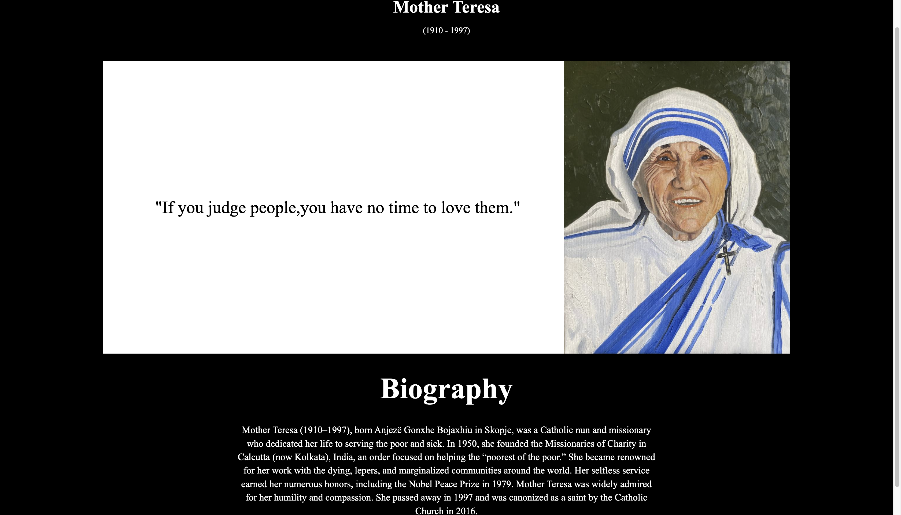

# Tribute Page for Mother Teresa

This is a simple **tribute webpage** dedicated to *Mother Teresa (1910-1997)*. The page features a quote, an image, and a brief biography.

---

## Features

- **Header**: Displays the name and life span of Mother Teresa.
- **Quote**: An inspirational quote:  
  *"If you judge people, you have no time to love them."*
- **Image**: A beautiful image of Mother Teresa.
- **Biography Section**: Includes a brief history of Mother Teresa's life and contributions.

---

## Technologies Used

- **HTML**: Structure of the webpage.
- **CSS**: Basic styling for alignment and layout.

---

## How to View the Project

Open the index.html file in any browser to view the tribute page.

## Screenshot

---

## Purpose of the Project

This project was created as part of my web development practice to learn HTML/CSS and build tribute pages.

---

## Acknowledgments

- The quote and biography information are attributed to **Mother Teresa**.
- The project structure was inspired by freeCodeCamp's **"Responsive Web Design"** challenge.
